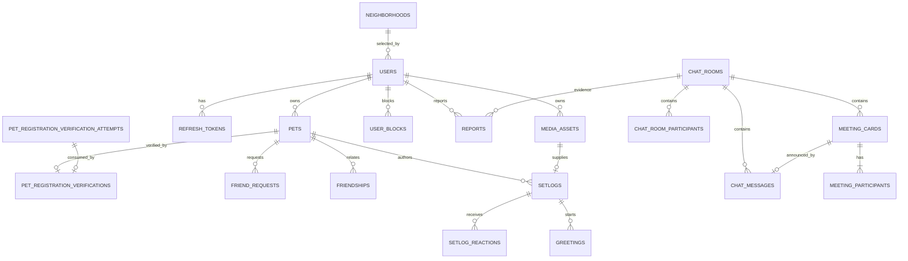

# 같이놀개 M1 통합 ERD rev3

> 기준: 2026-07-24 최신 제품 정책
> 범위: 회원·동네·Pet·등록인증·시드 셋로그·반응·인사·DIRECT 채팅·친구·차단·약속카드·신고·관리자 처리
> M2: Google 로그인·GPS·사용자 셋로그 업로드·지도·만남·후기·그룹채팅·대화 맥락 검열

## 1. 핵심 변경

- 우리 동네 이웃 목록을 제거했다.
- M1 홈은 S3 시드 셋로그 3개만 조회한다.
- 차단과 신고를 M1에 포함했다.
- 욕설 자동 차단과 일일 AI 검열을 M1에서 제거했다.
- 친구는 채팅 게이트가 아니며, 인사가 DIRECT 방을 만든다.
- 재인사를 제거하고 방향별 Greeting 이력을 영구 보존한다.
- 무답 방은 24시간 후 물리 삭제하되 신고 방은 보존한다.
- 답변한 비친구 방은 30일 무활동 시 `ARCHIVED`로 전환한다.

## 2. 관계도

`greetings.room_id`는 생성 당시 방 ID를 보존하는 식별자 스냅샷이다.
무답 방을 물리 삭제한 뒤에도 Greeting 이력을 남겨야 하므로 물리 FK는 두지 않는다.
방이 존재하는 동안 논리 관계는 ChatRoom 1:N Greeting이다.

## 3. 사용자와 Pet

### USERS

- `public_tag`는 필수·Unique다.
- `active_pet_id`가 없으면 L1이다.
- 관리자가 Active Pet을 정지하면 `active_pet_id=NULL`로 변경한다.
- `WITHDRAWN`, `withdrawn_at`은 POST-M1 회원탈퇴 확장용 구조다.
- M1에서는 회원탈퇴 Service와 관계 정리를 구현하지 않는다.

### PETS

- `public_tag`는 `<nickname>#XXXX` 형식의 필수·Unique 공개 검색 식별자다.
- 같은 owner의 `deleted_at IS NULL` Pet은 최대 5마리다.
- `SUSPENDED`는 한도에 포함하고 `DELETED`·`deleted_at IS NOT NULL`은 제외한다.
- `status = DELETED ↔ deleted_at IS NOT NULL`을 DB CHECK와 서비스 전이에서 함께 보장한다.
- Active Pet은 삭제할 수 없다.
- 일반 Pet 삭제 시 Friendship 삭제와 PENDING 친구요청 취소만 수행한다.
- 과거 요청·채팅·메시지·신고는 보존한다.
- Pet 생성 트랜잭션에서 owner를 직렬화하고 생성 전 미삭제 Pet 수로
  내부 `firstPetCandidate`를 확정한다.
- 생성 Commit 뒤 후보인 경우에만 Active 지정을 별도 트랜잭션으로 실행한다.
- Active 지정 실패는 Pet 생성을 되돌리지 않으며 L1 사용자는 기존 Active 선택 API로 복구한다.

## 4. 등록정보 조회

- 식별자는 `REGISTRATION_NUMBER`, `RFID`를 허용한다.
- 보호자 이름·생년월일은 Provider 요청에만 사용하고 저장하지 않는다.
- M1 Provider 호출은 동기 처리한다.
- canonical 등록번호가 없으면 Attempt를 `REJECTED`로 종결하고 배지를 발급하지 않는다.
- Attempt에 `consumed_pet_id`, `updated_at`을 둔다.
- 활성 `token_hash`는 Partial Unique다.
- consume은 `SUCCEEDED` Attempt에서만 허용하고 이미 소비된 Attempt는 상태 충돌로 처리한다.
- 인증 근거 스냅샷을 Verification에 저장한다.
- 인증 근거 필드 변경 시 상태를 `REVOKED`로 바꾼다.

## 5. 인사와 채팅

### GREETINGS

- `setlog_id NOT NULL`
- `room_id NOT NULL`
- 상태: `SENT`, `RESPONDED`, `EXPIRED`
- `CONVERTED` 없음
- `(from_pet_id, to_pet_id)` Unique로 재인사를 영구 차단한다.
- Pet당 하루 10명 제한은 서비스·쿼리 정책으로 집행한다.

### CHAT_ROOMS

- M1 타입은 `DIRECT`
- 상태: `ACTIVE`, `ARCHIVED`
- `CLOSED` 없음
- 차단 여부는 `user_blocks`가 정본이며 방 상태로 중복 표현하지 않는다.
- DIRECT pair는 두 Pet 정렬 pair에 Partial Unique를 둔다.
- 친구 삭제 후에도 기존 방은 유지한다.

### CHAT_MESSAGES

- 유형: `TEXT`, `CARD`, `SYSTEM`
- 사용자가 직접 보내는 유형은 `TEXT`뿐이다.
- `(room_id, client_message_id)` Unique로 멱등성을 보장한다.
- M1 `moderation_status` 없음
- 신고되지 않은 무답 Greeting 방 삭제 시 메시지도 함께 삭제한다.

## 6. 친구와 차단

- Friend Request pair는 Generated Column으로 계산한다.
- 반대 방향 PENDING 요청은 자동수락한다.
- PENDING 요청은 7일 후 `EXPIRED`다.
- Friendship은 정렬 Pet pair 한 행 존재가 현재 관계다.
- Pet당 Friendship 최대 50개다.
- 차단은 User 단위이며 M1이다.
- 차단 시 Friendship 삭제, 양방향 PENDING 요청 취소,
  인사·메시지·콘텐츠 노출을 차단한다.
- M1 차단 해제는 없다.

## 7. 셋로그

- `media_asset_id NOT NULL`
- M1은 `is_seed=true`인 영상 3개만 홈에 노출한다.
- API는 비공개 S3 Presigned GET URL과 만료 시각을 함께 반환한다.
- 상태: `VISIBLE`, `DELETED_BY_AUTHOR`
- `HIDDEN_BY_MODERATION` 없음
- 반응은 `CUTE`, `LIKE`이며 같은 Pet이 두 반응을 동시에 남길 수 있다.
- 자기 User 소유 Pet의 셋로그에는 반응할 수 없다.
- 반응 알림은 없고 카운트만 제공한다.

## 8. 약속 카드

- 친구 여부와 무관하게 생성할 수 있다.
- 확정 시 `card_type`, `place_text`, `meet_at`이 필수다.
- `card_type`은 `WALK`, `PLAY`, `OTHER`다.
- M1 참여 Pet은 두 마리다.
- 양쪽 참여 Pet 모두 취소할 수 있다.
- 수정은 제공하지 않으며 취소 후 새 카드를 만든다.
- 카드 상태는 `OPEN`, `CANCELED`다.

## 9. 신고와 관리자

- `reports`는 M1 필수 테이블이다.
- 신고와 차단은 별개이며 신고가 차단을 자동 실행하지 않는다.
- Report는 DIRECT 방을 필수로 참조한다.
- 관리자는 신고 사유와 해당 방 전체 메시지를 열람한다.
- 신고가 존재하는 방은 무답 물리 삭제 대상에서 제외한다.
- 관리자 조치는 `admin_actions`에 사유·전후 상태와 함께 기록한다.
- Report 상태는 `OPEN`, `ACTIONED`, `NO_ACTION`이다.
- 동일 신고자·방의 `OPEN` 신고는 하나만 존재한다.
- 신고 사유는 `HARASSMENT`, `SPAM`, `OTHER`이며 `OTHER`는 상세 사유가 필수다.
- M1 관리자 조치는 `DISMISSED`, `WARNING`이며 종결 후 재처리할 수 없다.

## 10. M1 제외

- `moderation_runs`
- AI 대화 맥락 검열
- 욕설·비속어 자동 차단
- Google 로그인
- GPS 동네 확인
- 사용자 셋로그 업로드
- 지도·장소·만남 확인·후기·발자국
- 그룹 채팅

## 11. 실제 PostgreSQL 제약

상세 DDL은 같은 폴더의 `01_M1_통합_ERD.sql`을 정본으로 한다.

- Lowercase email Unique
- User public tag Unique
- 활성 등록 Attempt token Partial Unique
- 인증된 canonical fingerprint Partial Unique
- PENDING Friend Request pair Partial Unique
- Friendship 정렬 pair Unique
- DIRECT ChatRoom pair Partial Unique
- ChatMessage 멱등키 Unique
- Setlog Reaction `(setlog, reactor_pet, type)` Unique
- 상태별 CHECK와 자기 자신 관계 방지 CHECK
