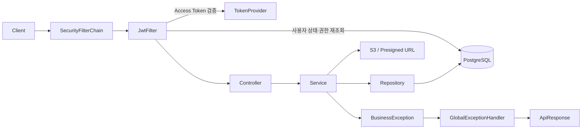
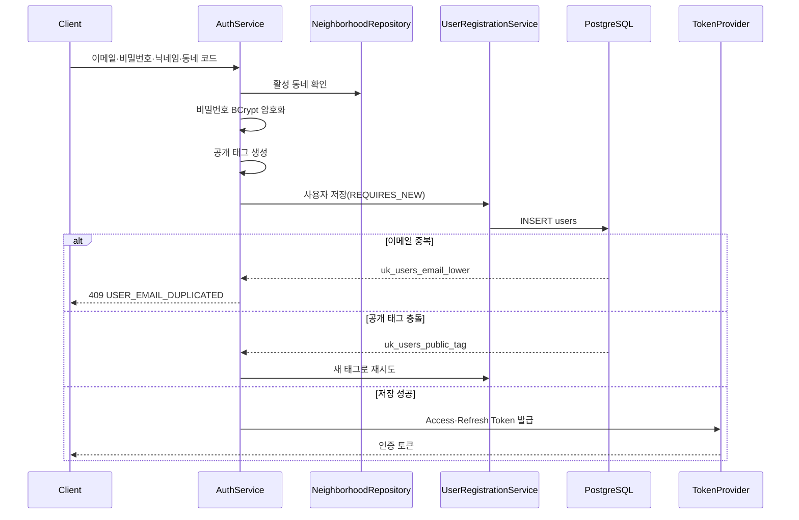
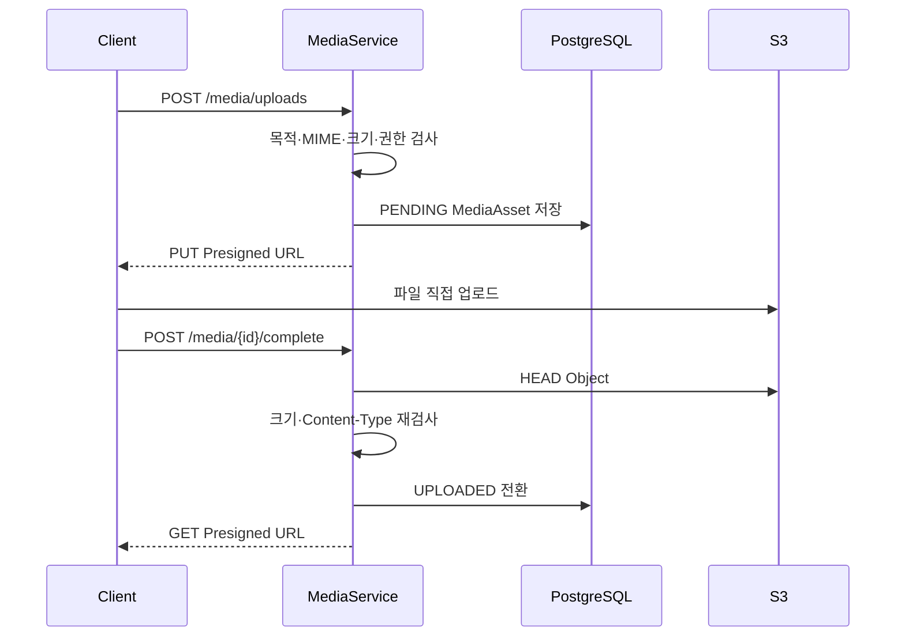

# Dogether 백엔드 기본설정 온보딩

이 문서는 이번 기본설정 PR의 코드를 처음 보는 팀원이 구조와 설계 이유를 빠르게
파악할 수 있도록 작성했다. 상세 제품 정책은 별도 기획 산출물을 따르며, 이 문서는
현재 `dev`에 병합된 공통 기반만 설명한다.

## 1. 지금 구현된 범위

현재 코드는 M1 전체 기능 구현이 아니라 다음 기능을 개발하기 위한 공통 기반이다.

- 이메일 회원가입·로그인·토큰 재발급·로그아웃
- JWT 기반 인증과 USER·ADMIN·SUPER_ADMIN 권한
- PostgreSQL·JPA·Flyway 기반 데이터 접근
- S3 Presigned URL 기반 미디어 업로드
- 공통 성공·실패 응답과 전역 예외 처리
- 로컬·운영 환경 분리 및 GitHub Actions CI

Pet, 셋로그, 인사, 채팅, 친구, 차단, 약속 카드, 신고·관리자 처리의 실제 API와
테이블은 이후 작업에서 추가한다. 현재 `ErrorCode`에 포함된 해당 도메인 오류는
확정된 M1 계약을 미리 반영한 값이다.

## 2. 요청이 처리되는 전체 흐름



Access Token의 사용자 ID만 신뢰하고, 요청마다 DB에서 사용자를 다시 조회한다.
따라서 사용자가 정지되거나 권한이 변경되면 기존 Access Token이 남아 있어도 다음
요청부터 현재 DB 상태가 적용된다.

## 3. 패키지별 역할

| 경로 | 역할 |
|---|---|
| `auth/` | 회원가입, 로그인, Refresh Token 재발급, 로그아웃 |
| `common/config/` | Security, JPA, S3, Swagger, 스케줄링 설정 |
| `common/security/` | 현재 사용자 principal, 토큰 해시, Refresh Token |
| `common/filter/` | JWT를 읽고 Spring Security 인증 객체 생성 |
| `common/eventhandler/` | 예외를 공통 API 오류 응답으로 변환 |
| `common/properties/` | 환경변수 바인딩 및 시작 시 설정값 검증 |
| `user/` | User·Role·AccountStatus와 공개 태그 생성 |
| `neighborhood/` | 회원가입 시 선택하는 동네 정본 |
| `media/` | 미디어 메타데이터와 S3 Presigned URL 흐름 |
| `db/migration/` | 모든 환경에 적용되는 Flyway 스키마 |
| `db/seed/` | local 프로필에서만 적용되는 개발 데이터 |

## 4. 인증 구조

### 회원가입



PostgreSQL은 제약 위반이 발생한 트랜잭션을 계속 사용할 수 없다. 그래서 사용자
저장을 `UserRegistrationService`의 `REQUIRES_NEW` 트랜잭션으로 분리했다.
실패한 저장이 완전히 롤백된 뒤 이메일 중복을 변환하거나 공개 태그를 다시 만든다.

### Access Token

- JWT이며 Authorization 헤더의 `Bearer` 방식으로 전달한다.
- 서명, issuer, 만료, `tokenType=ACCESS_TOKEN`을 검증한다.
- 토큰의 사용자 ID로 DB를 다시 조회하고 ACTIVE 계정만 인증한다.
- `CurrentUser`에는 비밀번호 해시를 넣지 않는다.

### Refresh Token

- JWT가 아닌 32바이트 임의 opaque token이다.
- 원문은 클라이언트에만 전달하고 DB에는 SHA-256 해시만 저장한다.
- 재발급할 때 기존 토큰 row를 비관적 잠금하고 즉시 폐기한 뒤 새 토큰을 발급한다.
- 만료 토큰의 `revoked_at`도 예외 응답 전에 커밋되도록 구성했다.
- 로그아웃은 해당 사용자의 활성 Refresh Token을 모두 폐기한다.

## 5. 권한 규칙

| 경로 | 접근 권한 |
|---|---|
| `GET /neighborhoods` | 공개 |
| `POST /auth/signup` | 공개 |
| `POST /auth/login` | 공개 |
| `POST /auth/refresh` | 공개 |
| `/actuator/health` | 공개 |
| Swagger 경로 | local·개발에서 공개, prod에서 비활성화 |
| `/admin/**` | ADMIN 또는 SUPER_ADMIN |
| 그 외 API | 로그인 사용자 |

SUPER_ADMIN > ADMIN > USER 역할 계층을 사용한다. 관리자 경로의 정본은
`/admin/**`이며 `/api/admin/**`가 아니다.

## 6. 미디어·S3 구조

클라이언트가 서버를 거쳐 파일 전체를 전송하지 않고 S3에 직접 업로드한다.



- 현재 기반 코드는 일반 USER의 `SETLOG` 목적 업로드만 차단한다.
- 최종 M1 계약에서는 일반 USER가 범용 `/media/**` 흐름을 사용할 수 없도록
  Controller·Security·Service Gate를 추가로 정렬해야 한다. 이는 배포 전
  보완 작업이며 현재 구현 완료로 보지 않는다.
- M1 시드 셋로그는 관리자 계정이 적재한다.
- local endpoint를 사용할 수 있도록 S3Client와 S3Presigner 모두 path-style
  설정을 공유한다.
- 업로드 URL이 만료되면 `complete` 트랜잭션에서 `EXPIRED`를 저장하고 410을
  반환한다. 이 메서드는 해당 `BusinessException`이 발생해도 상태 변경을 커밋하도록
  `noRollbackFor`를 명시한다.
- 삭제 요청과 미완료 업로드 정리는 스케줄러가 최대 100개씩 처리한다.

## 7. DB와 Flyway

| Migration | 내용 |
|---|---|
| `V1` | neighborhoods |
| `V2` | users, 역할·계정 상태·동네 FK |
| `V3` | 해시된 Refresh Token |
| `V4` | media_assets |
| `V5` | 사용자 공개 태그와 Unique 제약 |

공유된 migration은 수정하지 않고 변경할 때마다 다음 버전 파일을 추가한다.
PostgreSQL이 정본이며 H2는 빠른 단위·컨텍스트 테스트에만 사용한다.

local 프로필에서는 repeatable seed로 다음 동네를 입력한다.

| 코드 | 지역 |
|---|---|
| `4113111500` | 경기도 성남시 수정구 시흥동 |
| `4113111600` | 경기도 성남시 수정구 금토동 |
| `4113111700` | 경기도 성남시 수정구 사송동 |

운영 프로필에는 이 seed 경로가 포함되지 않는다.

`application.yaml`의 Flyway 기본값은 `true`지만 현재 팀 기본 `.env.example`은
배포 전까지 `FLYWAY_ENABLED=false`를 사용한다. 새로운 로컬 DB를 처음 구성하거나
Migration·Seed 적용이 필요하면 `.env`에서 `FLYWAY_ENABLED=true`로 변경한 뒤
애플리케이션을 실행한다. Flyway가 활성화된 local 프로필은 `db/migration`과
`db/seed`를 모두 적용한다.

## 8. 환경설정

로컬에서는 `.env.example`을 `.env`로 복사한다. 실제 비밀번호·JWT Secret·AWS
키는 Git에 올리지 않는다.

주요 설정:

- `SPRING_PROFILES_ACTIVE=local`
- `DB_URL`, `DB_USERNAME`, `DB_PASSWORD`
- `JWT_SECRET`, Access·Refresh TTL
- `AWS_REGION`, `S3_BUCKET`, 선택적 local endpoint
- CORS 허용 origin
- 미디어 URL TTL과 최대 업로드 크기
- 선택적 초기 SUPER_ADMIN 계정

JWT, S3, Media, CORS의 필수값이 비어 있거나 TTL·크기가 올바르지 않으면
애플리케이션 시작 단계에서 실패한다. 운영에서는 IAM Role 또는 AWS 표준
자격증명 체인을 사용한다.

Google OAuth는 M2 범위이므로 현재 의존성에서 제거했다. 구현 시점에 Google
OAuth2 Client 의존성과 계약을 함께 추가한다.

## 9. 테스트와 CI

빠른 테스트:

```powershell
.\gradlew.bat test
```

PostgreSQL·Flyway 통합 테스트:

```powershell
.\gradlew.bat postgresTest
```

`postgresTest`는 Docker가 필요하며 Docker가 없으면 SKIP하지 않고 실패한다.
이 테스트는 다음을 실제 PostgreSQL에서 검증한다.

- 전체 migration과 Hibernate 모델의 정합성
- local 동네 seed SQL
- 만료 Refresh Token의 폐기 상태 커밋

GitHub Actions는 PR과 `dev`, `main` push에서 `test`와 `postgresTest`를 모두
실행한다.

## 10. 기능을 추가할 때 지킬 규칙

1. 응답은 `ApiResponse<T>` 형식을 사용한다.
2. 예상 가능한 실패는 `BusinessException`과 Dogether `ErrorCode`로 표현한다.
3. 없는 URL은 404, 예상하지 못한 서버 오류만 500으로 반환한다.
4. 로그인 여부뿐 아니라 Pet 소유권·활성 Pet·차단·친구 등 도메인 권한을
   Service에서 다시 검사한다.
5. DB 변경은 새 Flyway migration으로 추가한다.
6. PostgreSQL 전용 제약·인덱스·동시성 로직은 `postgresTest`로 검증한다.
7. API·enum·상태가 바뀌면 관련 계약 문서도 같은 PR에서 수정한다.

## 11. 리뷰할 때 우선 볼 파일

1. [`SecurityConfig.java`](../src/main/java/itda/common/config/SecurityConfig.java)
2. [`JwtFilter.java`](../src/main/java/itda/common/filter/JwtFilter.java)
3. [`TokenProvider.java`](../src/main/java/itda/common/security/service/TokenProvider.java)
4. [`AuthService.java`](../src/main/java/itda/auth/service/AuthService.java)
5. [`UserRegistrationService.java`](../src/main/java/itda/auth/service/UserRegistrationService.java)
6. [`MediaService.java`](../src/main/java/itda/media/service/MediaService.java)
7. [`MediaMaintenanceService.java`](../src/main/java/itda/media/service/MediaMaintenanceService.java)
8. [`db/migration/`](../src/main/resources/db/migration/)
9. [`ci.yml`](../.github/workflows/ci.yml)

리뷰 시에는 정상 요청뿐 아니라 동시 회원가입, 정지 계정, 만료 토큰, 만료
업로드, USER의 관리자 경로 접근처럼 실패 경로의 DB 상태가 올바르게 남는지도
확인한다.
